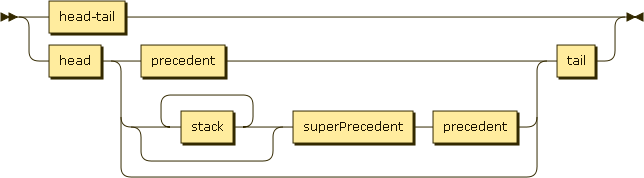

# Stack

*Stack* places any number of functions into a
[singly-linked list](http://en.wikipedia.org/wiki/Linked_list) structure.  You can modify
that structure and perform various styles of execution against some or all of the list.

I use notation similar to other diagrams used for singly-linked lists: `[<function>] -> [x]`.
Brackets around a function, the stack's `.fn` property, indicate a stack.
The arrow indicates the _link_, a stack's `.next` property.
And the `[x]` is a special notation representing `undefined` or the _empty stack_ (not to
be confused with the identity stack).
When the `->` points to a name without brackets, like `-> myStack`, the name represents a stack.

*Stack* encourages small units of testable, reusable code.

## Contents

I divided the API into four main sections:

- [Construction](#construction)
- [Utilities](#utilities)
- [Manipulation](#manipulation)
- [Search](#search)
- [Execution](#execution):
    - [flow control](#flow)
    - [composition](#composition)
    - [continuation](#continuation)
    - [promise](#promise)
    - [branching logic](#branching)
    - [recursion](#recursion)

## Construction

Each instance of *Stack* is a _NODE_.  Each _NODE_ linked to another stack is the _HEAD_
of that *stack-list*.  Any _NODE_ not linked to another stack is a _TAIL_.  Other positions
in a stack list have names for convenience and [searching](#search).



Examples:

- `Stack() // [identity] -> [x]`
- `Stack(myFunc) // [myFunc] -> [x]`
- `Stack(myFunc, nextStack) // [myFunc] -> nextStack -> [x]`

A *stack-list* can be built using an array of functions and/or stacks.  When a *stack-list*
is linked using an array, the next array element will be linked to the _TAIL_ of the
previous *stack-list*:

Examples with an array:
- `Stack([funcC, funcB, funcA]) // [funcA] -> [funcB] -> [funcC] -> [x]`
- `Stack([stackB, stackA, funcA]) // [funcA] -> [stackA.fn] ->...-> [stackB.tail().fn] -> [x]`

## Utilities

`Stack.alias`, a static method, allows you to create your own grammar by renaming methods.
`.pause()` allows stack execution to stop and return a [Continuation](#continuation).

## Manipulation

You can manipulate *stack-lists* using array-like methods such as `.push()` (alias `.from()`), `.pop()`,
`.shift()`, and `.unshift()`. Other manipulation methods include `.insert()` (alias `.to()` or `.compose()`),
`.remove()` and `.drop()`.  Manipulation methods that add or create a stack can take either functions
or stacks as parameters.

## Search

These methods fall into two groups.  The first group runs the function against the stack _NODE_ in
context and returns a boolean.  The second group will recur the same function over an entire *stack-list*
returning the first stack with a "truthy" result.  Since a trampoline pattern governs the recursion,
you can not overflow the call stack.

You can use the exposed `.recur()` method to create your own styles of searching.

## Execution

Calling an execution method on a *stack-list* will run the linked functions by the rules of the method.
As with methods using `.recur()`, execution methods use a trampoline pattern with `.iterate()` and can
not exceed the call stack.

You can use the exposed `.iterate()` method to create your own styles of execution.

All execution methods can use a receiver object.  This object provides context to the iterating function
in place of the stack.

### Flow

Stacks can be understood as series of atomic operations; a simple, imperative program.
`.assign()` and `.spread()` can provide argument(s) to each function in the series, executing each
step until: completion, continuation, or promise.

Flow/app state can be shared through an object argument.

```javascript
var state = {steps:[]};

Stack([function (state) {
        state.steps.push("step2");
        state.step2 = "done";
    }, function (state) {
        state.steps.push("step1");
        state.step1 = "done";
    }]).assign(state);

//state: {steps: ["step1", "step2"], step1: "done", step2: "done"}
```

`.some()` and `.every()` methods work like assign, but also allow for early completion by limiting
execution to the first true or false value respectively.

### Composition

Stacks can also accomplish complex compositions due to their trampoline.
Methods `.pipe()` and `.funnel()` compose functions in (LIFO) order.
Each stack _HEAD_ can be piped or funneled, passing its function's output until it returns
from the stack _TAIL_

Developers may find this style of composition easier to read and reason about when using several functions.

Just remember, when using an array of functions, the _HEAD_ is on "top", at the "end" of the array.

```javascript
Stack([sum, doubleAll, flatten]).funnel([[1],[2],[3]])// 12;
```

`.pipe()` passes its argument to the stack HEAD's function.  The output of _HEAD's_
function is then passed to _HEAD_.next.pipe (e.g., f = _HEAD_, g = _HEAD_.next: `g(f(x))`) and so on
until: completion (stack.next is undefined), a continuation is returned, or a promise is returned.

`.funnel()` works similarly to `.pipe()`, except that it can take and pass multiple arguments.

### Continuation

Stacks can pause execution to return a continuation object by returning `this.pause()` or `Stack.pause`
(in cases where the execution uses a receiver object).
You can use continuations for partial application, asynchronous processing, or debugging.

### Promise

Stacks assume the [when.js](https://github.com/cujojs/when) implementation of promises to defer execution

```javascript
var value = false;
Stack([function () {
        value = true;
    }, function () {
        defer = when.defer();
        return defer.promise;
    }]).assign();
//value will remain false until the promise is resolved.
```

If a stack returns a resolved promise, its `.then()` method will be executed immediately.

### Branching

While iterating, stacks can return other stacks to dynamically branch a process.
Stacks can also modify the stack structure while processing resulting in a more "permanent"
type of branched execution path.

```javascript
var a = function (x) {return x + "a";},
    b = function (x) {return x + "b";},
    c = Stack(function (x) {return x + "c";}),
    gotoC = function (x) {return x.length > 1 ? c : x;},
    s  = Stack([c,b,gotoC,a])
s.pipe("1") // "1ac"
s.pipe("") // "abc"
```

### Recursion

Branching can also create recursive execution, where the same stack or stack-list executes many times.

```javascript
var checkTotal = Stack(function (x) {return x < 10 ? add1 : x}),
    add1 = Stack(function (x) {return x + 1;}, checkTotal);
add1.pipe(1); // 10
```